# 基于Springboot的海滨体育馆管理系统

## Springboot-0036


## 技术栈

Springboot mybatisplus vue mysql maven


## 数据库表(15张)


## 功能介绍

```properties
管理员登录后可对系统进行全面管理操作，包括个人中心、学生管理、器材管理、器材借出管理、器材归还管理、器材分类管理、校队签到管理、进入登记管理、离开登记管理、活动预约管理、灯光保修管理、体育论坛以及系统管理。

学生在系统前台可查看系统信息，包括首页、器材、体育论坛以及体育资讯等，没有账号的学生可进行注册操作，注册登录后主要功能模块包括个人中心、器材管理、器材借出管理、器材归还管理、校队签到管理、进入登记管理、离开登记管理、活动预约管理，
```


## 图片

### 前台


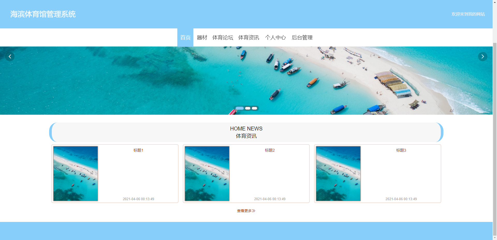


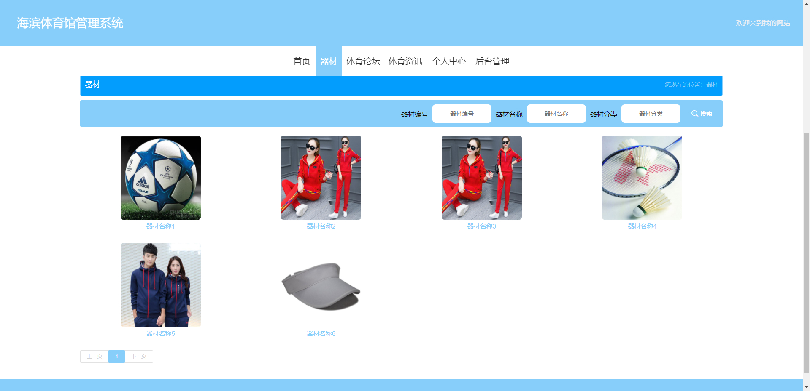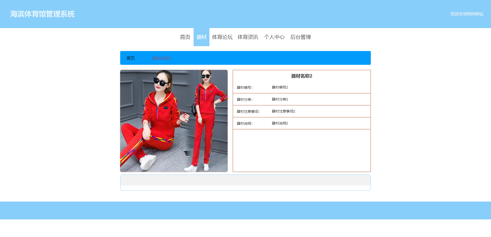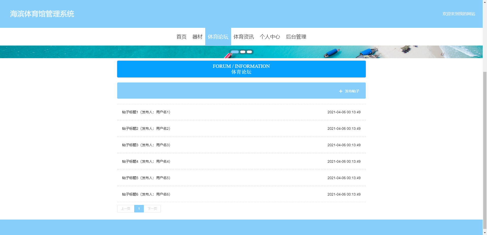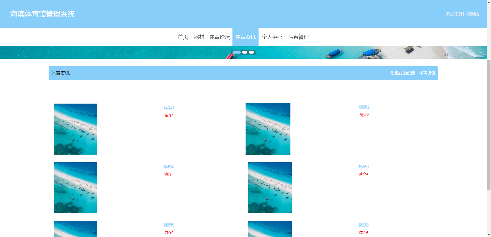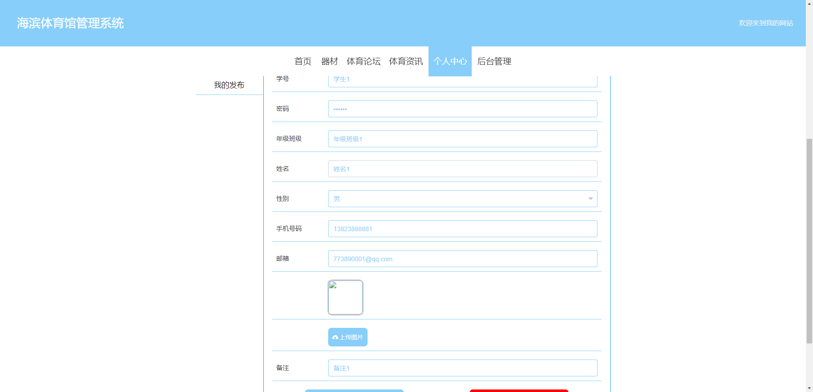


### 后台


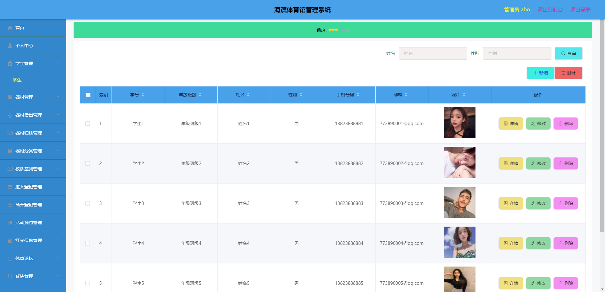

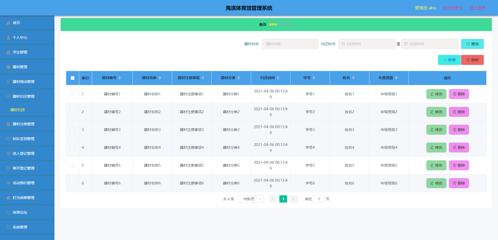

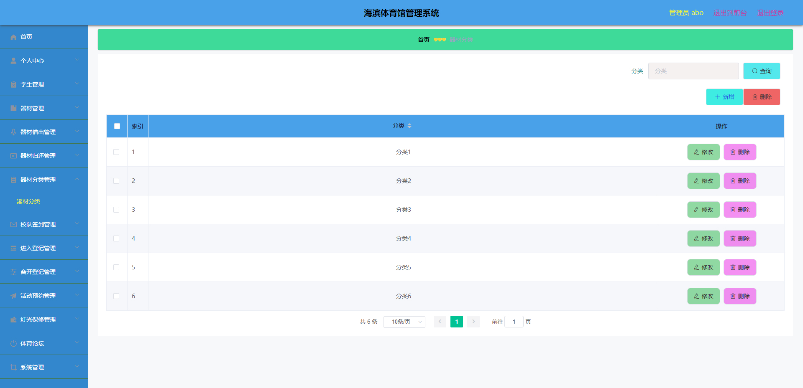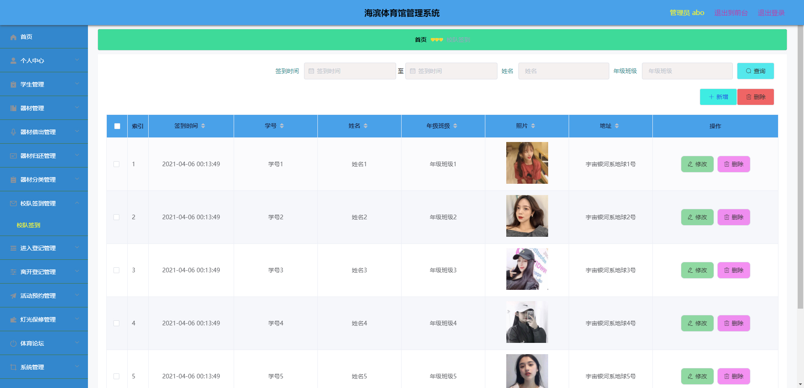


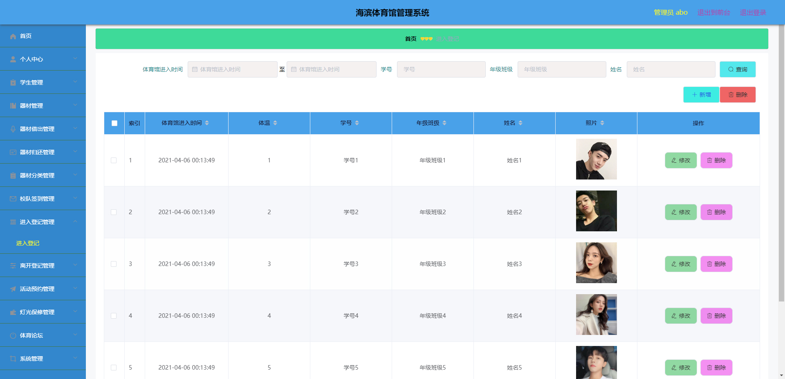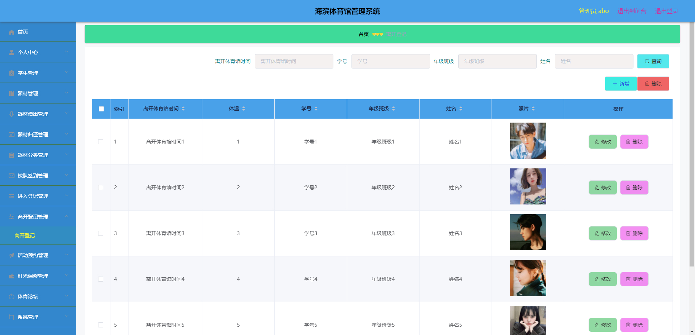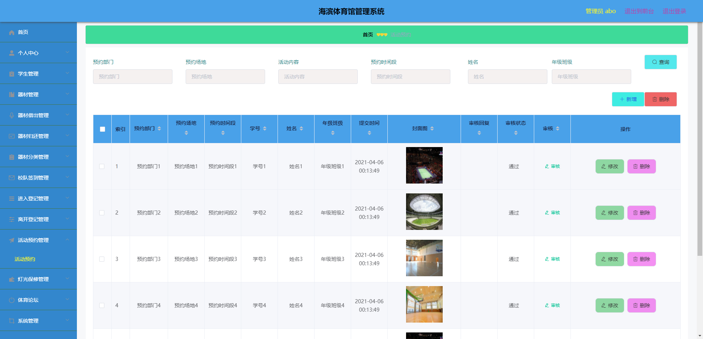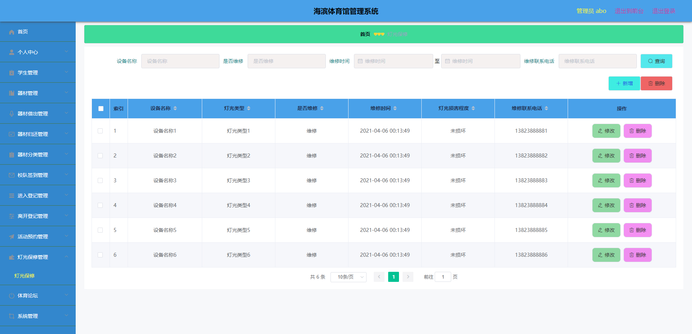

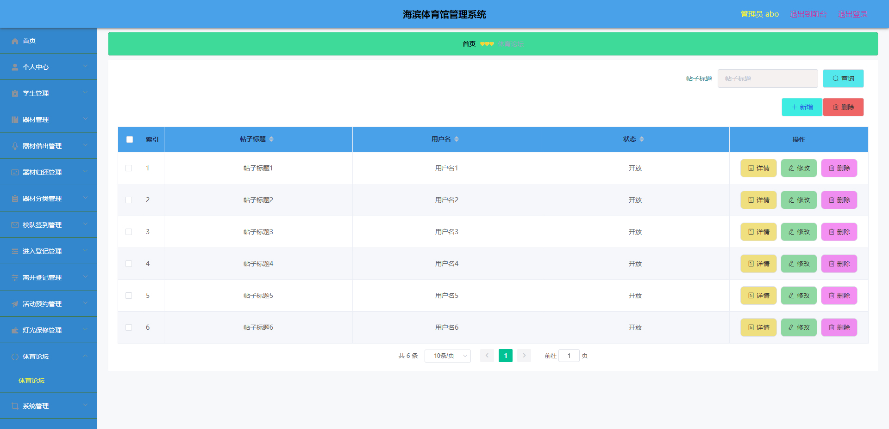


## 访问路径

### 前台

```properties
http://localhost:8080/springboot2yx3h/front/pages/login/login.html

账号 学生1
密码 123456
```

### 后台

```properties
http://localhost:8080/springboot2yx3h/admin/dist/index.html#/login

账号 abo
密码 abo
```


## 功能图

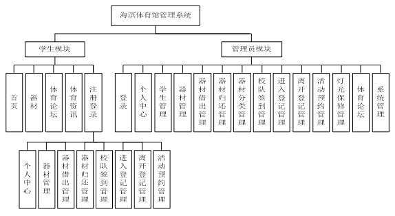


## 文档目录

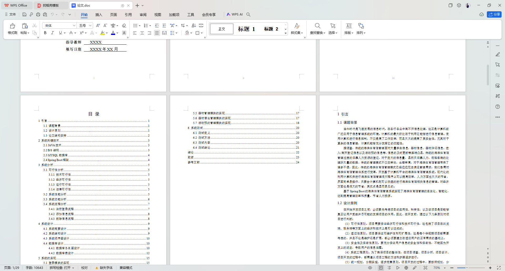


## 打赏或交流


